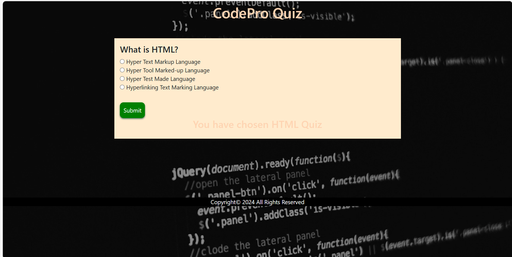

# Code-Pro

## Description

CodePro is a web application designed to help students test their knowledge of HTML, CSS, or JavaScript concepts. Users can take a quiz consisting of multiple-choice questions related to HTML, CSS, and JavaScript and receive immediate feedback. They can also retake the quiz by returning to the home screen.

## Installation

First, clone the repository using the following command "git clone https://github.com/hydro8188/code-pro.git". Next, navigate to the project's directory using "cd code-pro". Open the "index.html" file in your web browser to start using the CodePro site.

## Usage

This site is used by coding beginners to test their knowledge of coding topics they've learned during a coding bootcamp.

## Credits

Jermaine Strand, Deepthi Girija Thampi, Yunus Emre Ertas, Coding Bootcamp TAs.

## Technologies Used

HTML, CSS, JavaScript, Bootstrap.

## Resources

MDN Reference, https://w3Schools.com/, https://microsoft.com/, https://stackoverflow.com/, https://wallpaperaccess.com/full/5277922.jpg

## License

Copyright (c) 2024 All Rights Reserved.

